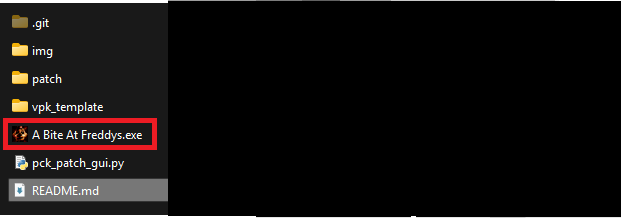
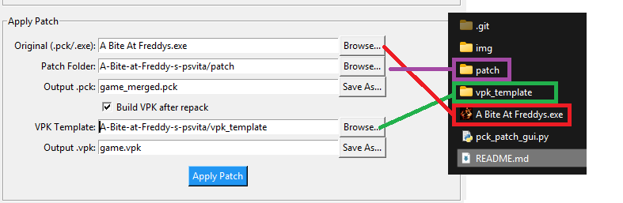
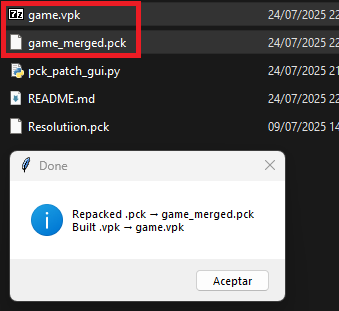
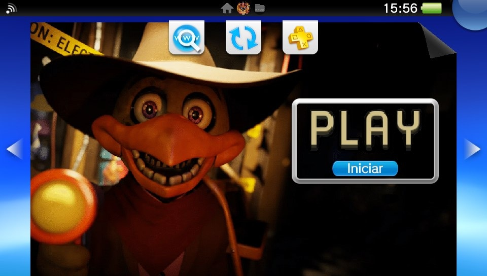
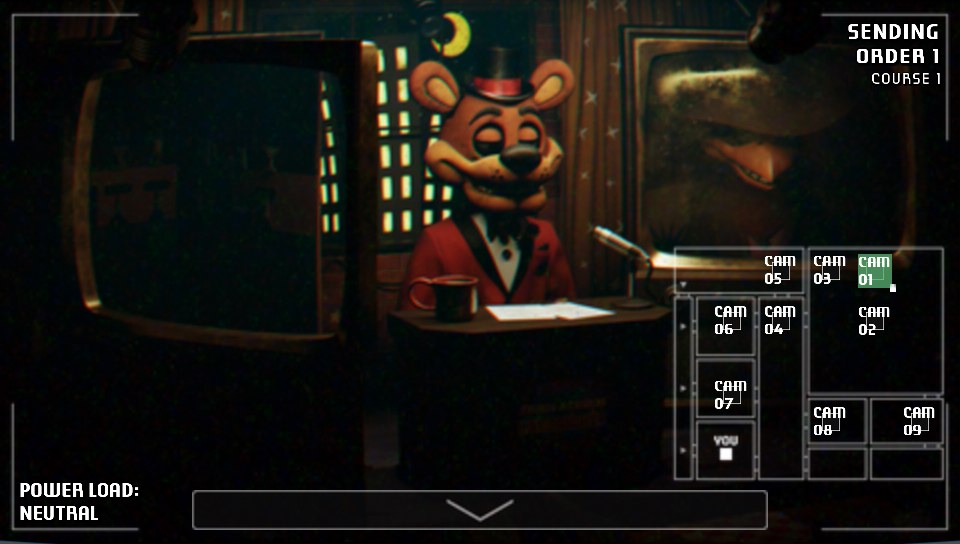
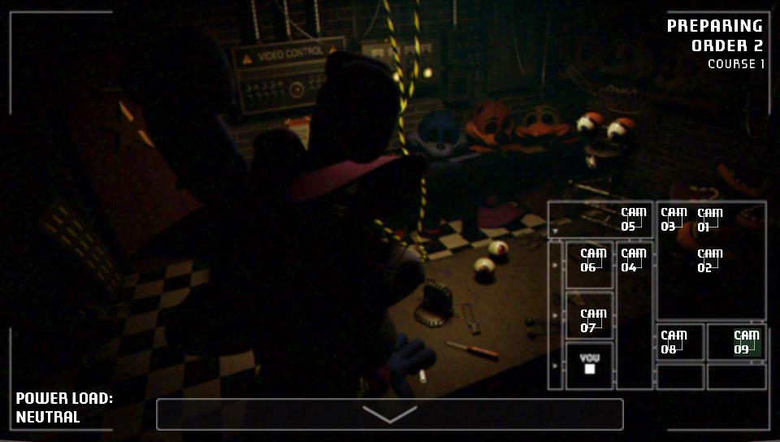
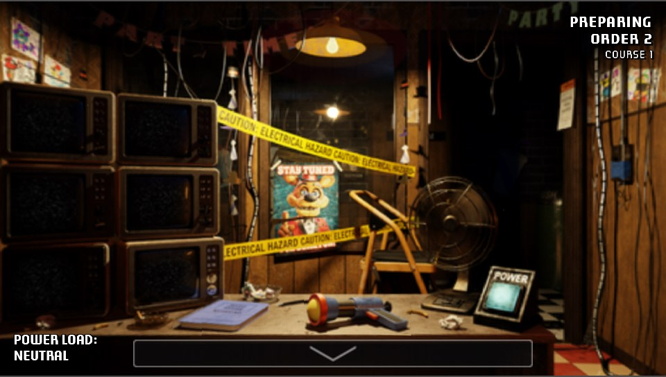
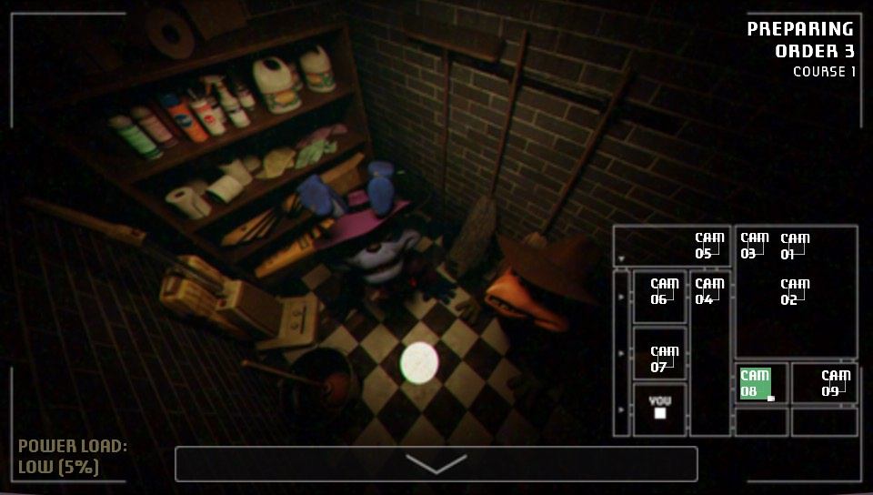
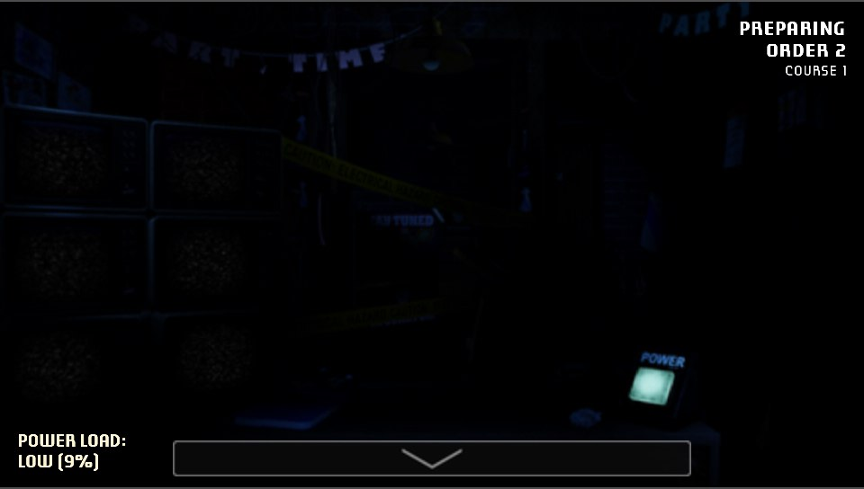

# A Bite at Freddy's — PSVita Patch

**A patch for _A Bite at Freddy's_ to run on the PlayStation Vita.**  
**A Bite at Freddy's** is a bite-sized Five Nights at Freddy's experience. **Fnaf style**. reddy Fazbear's Grill needs your help to test and repair the Freddy Fast-Food Delivery machine! Work alongside the restaurant manager to ensure food orders can be delivered from kitchen to customer without issue.

Complete orders, repairs, and challenges!

---

## 🌐 Official Game Download

- [gamejolt.com](https://gamejolt.com/games/abaf/774513)  
- [Itch.io](https://garrett-mckay.itch.io/a-bite-at-freddys)

---

## 🎮 PSVita Patch Installation Guide

### 1. Download Required Files
- Get the game from [gamejolt.com](https://gamejolt.com/games/abaf/774513) or [Itch.io](https://garrett-mckay.itch.io/a-bite-at-freddys).
- Clone or download this **PSVita patch repository**.

### 2. Prepare the Game Files
- Locate `A Bite At Freddys.exe` in the downloaded game folder.
- Place it inside the patch repository folder.



### 3. Run the Patch Script

Using **Python 3**, execute the following command or double click it to execute it:

```bash
python pck_patch_gui.py
```

Set up the following paths and press **Apply Patch**



Once completed, you'll see:



### 4. Install on Your PSVita

You now have two options:

- **Install via VPK:**  
  Use **VitaShell** to install the generated `game.vpk`.

- **Manual Install:**  
  - Download the game from **VitaDB**.  
  - Replace the `.pck` file in `ux0:data/game_data/` with your `game_merged.pck`, renamed to `game.pck`.



---

## Changelog v1.01:
- Fixed Foxy behavior.
- Fixed broken PS Vita controls and buttons in Scene 2B.
- Upscaled Foxy sprites
- Upscaled sprites from camera buttons.
- Upscaled sprites from the FredChop animation.

---

## Known issues:

- This is the first release, so some bugs may occur.
  
---
## 📸 Screenshots

Complete orders, repairs, and challenges!:

 
 
  



## Credits

- BonQ for help in the porting process and suggesting me this game.
- [Wolff](https://github.com/WolffsRoom/) for reminding me that this project was a candidate.
